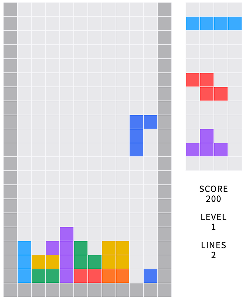
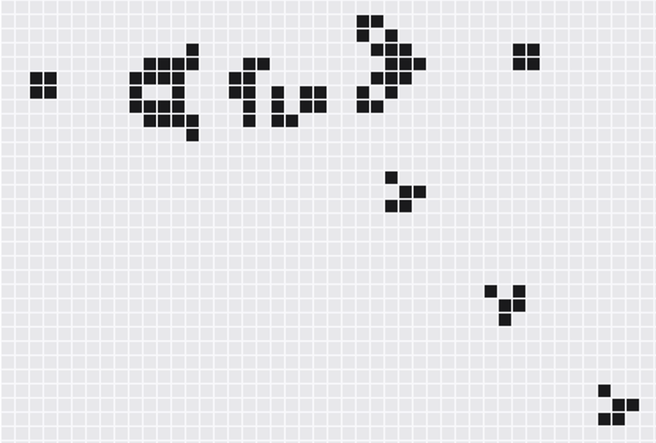

# BitBox - 2D pixel game framework
BitBox is a fun, free 2D game framework for making HTML games for desktop and mobile web browsers, supporting Canvas rendering.

## What You Can Build

Create retro-style pixel games with ease! Here are some examples:

<div align="center">
  
  
  
</div>

From classic arcade games to cellular automata simulations - BitBox makes it simple to bring your pixel game ideas to life.

## Install
pnpm
```
pnpm add @bitbox-js/core
```

## Usage

```js
import { State, Renderer, useCanvas } from '@bitbox-js/core'

export class GameState implements State {
  // Game logic here
  update(delta: number, key: string) {
    // ...
  }
}

export class GameRenderer implements Renderer {
  // BitBox calculates and sets this value
  blockWidth = 0
  state: GameState
  constructor(state: GameState) {
    this.state = state
  }
  // Rendering logic here
  draw(ctx: CanvasRenderingContext2D) {
    // ...
  }
}

const Page = () => {
  const state = new GameState()
  const renderer = new GameRenderer(state)
  const { canvasRef, togglePausing } = useCanvas(100, 50, renderer)

  return (
    <div className="w-full">
      <canvas ref={canvasRef} className="w-full h-max" />
    </div>
  )
}

export default Page
```

## Example code
These examples can be browsed on the stackblitz.
[bitbox-sample](https://stackblitz.com/edit/bitbox-sample)

## Use case
- [Game of Lif](https://9revolution9.com/games/automaton/gameoflife)
- [Elementary cellular automaton](https://9revolution9.com/games/automaton/eca)
- [Tetrimimus](https://9revolution9.com/games/tetrimimus)
- [Pac-Boy](https://9revolution9.com/games/pac-boy)
- [Invader Game](https://9revolution9.com/games/invaders)
